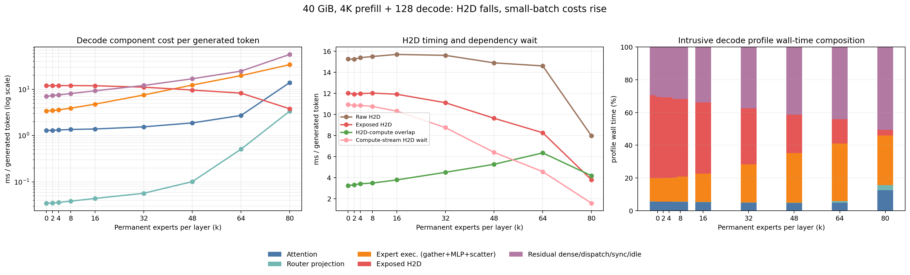
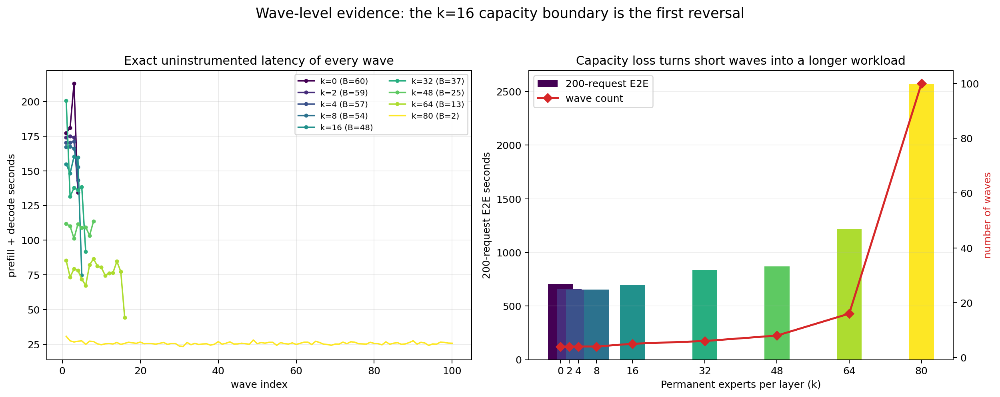

# 40 GiB 4K/128/200 breakdown study

## 결론: k=16부터 H2D 절감보다 batch collapse 비용이 커진다

이 sweep의 E2E 최적점은 그대로 `Permanent k=8`이다. k=0 대비 200-request
E2E가 705.695 s에서 653.552 s로 7.389% 감소한다. k=0~8은 모두 네
wave라서 Permanent hit와 Expert H2D 절감이 그대로 이득이 된다.

반전은 k=16에서 시작한다. 40 GiB 안에서 Bmax가 54에서 48로 내려가며
200 requests가 네 wave에서 다섯 wave가 된다. k=16의 decode exposed H2D는
11.906 ms/generated-token으로 k=8의 12.015 ms와 사실상 같지만, Expert 실행은
3.907→4.769 ms/token, residual은 8.089→9.265 ms/token으로 증가한다. 추가 partial
wave까지 생겨 E2E는 653.552→697.520 s로 6.73% 악화된다.

k=80에서는 H2D 감소 자체는 실제다. k=0 대비 raw H2D/token은 47.8%, exposed
H2D/token은 68.5%, copy event를 기다리는 compute-stream wait/token은 85.7%
감소한다. 그러나 Bmax=2로 인한 낮은 GPU 효율 때문에 Expert 실행/token은
10.05배, attention/token은 10.81배, router projection/token은 96.7배, 아직
분리되지 않은 dense/dispatch/host-sync/idle residual은 8.06배가 된다. 그 결과
100 waves가 필요하고 E2E는 k=0의 3.64배다.



## Decode의 큰 비중은 exposed H2D에서 residual과 Expert 실행으로 이동한다

아래 값은 각 K의 Bmax에서 수행한 별도 one-wave intrusive profile을 generated
token 수로 정규화한 값이다. batch가 서로 다르므로 raw one-wave 총시간을 직접
비교하지 않고 `ms/generated token`을 사용한다. `Profile wall`만 additive wall
partition이며, raw H2D·overlap·H2D wait는 서로 및 compute와 겹칠 수 있다.

| k | Bmax | Waves | Raw H2D | Exposed H2D | H2D-compute overlap | H2D wait | Expert execution | Attention | Router projection | Residual | Profile wall |
|---:|---:|---:|---:|---:|---:|---:|---:|---:|---:|---:|---:|
| 0 | 60 | 4 | 15.255 | 12.015 | 3.240 | 10.936 | 3.382 | 1.289 | 0.035 | 7.016 | 23.737 |
| 2 | 59 | 4 | 15.225 | 11.911 | 3.314 | 10.841 | 3.470 | 1.299 | 0.035 | 7.333 | 24.049 |
| 4 | 57 | 4 | 15.375 | 11.964 | 3.411 | 10.857 | 3.587 | 1.318 | 0.036 | 7.542 | 24.448 |
| 8 | 54 | 4 | 15.488 | 12.015 | 3.472 | 10.748 | 3.907 | 1.357 | 0.038 | 8.089 | 25.408 |
| 16 | 48 | 5 | 15.684 | 11.906 | 3.778 | 10.308 | 4.769 | 1.389 | 0.044 | 9.265 | 27.373 |
| 32 | 37 | 6 | 15.595 | 11.101 | 4.495 | 8.740 | 7.528 | 1.545 | 0.057 | 12.085 | 32.315 |
| 48 | 25 | 8 | 14.884 | 9.626 | 5.258 | 6.390 | 12.343 | 1.879 | 0.102 | 16.861 | 40.811 |
| 64 | 13 | 16 | 14.595 | 8.254 | 6.341 | 4.559 | 19.715 | 2.722 | 0.509 | 24.655 | 55.854 |
| 80 | 2 | 100 | 7.967 | 3.789 | 4.178 | 1.569 | 33.993 | 13.936 | 3.364 | 56.530 | 111.611 |

단위는 모두 `ms/generated token`이다. k=0에서는 exposed H2D가 profile wall의
50.6%로 가장 크다. k=32에서는 residual 37.4%, exposed H2D 34.4%, Expert 실행
23.3%가 되어 이미 H2D 단일 병목이 아니다. k=80에서는 residual 50.6%, Expert
실행 30.5%, attention 12.5%이고 exposed H2D는 3.4%뿐이다. 즉 높은 K 구간의
다음 최적화 대상은 H2D가 아니라 small-batch 실행 효율과 residual의 세분화다.

## Prefill도 높은 K에서 Expert 실행과 per-wave 고정비가 급증한다

Prefill profile은 `us/prompt token` 단위다. prompt token 수가 크기 때문에
decode와 단위가 다르다. Permanent buffer는 prefill부터 사용되지만, Bmax가
작아지면서 같은 200 requests를 더 많은 wave로 나누는 비용이 생긴다.

| k | Raw H2D | Exposed H2D | H2D overlap | H2D wait | Expert execution | Attention | Router projection | Residual | Profile wall |
|---:|---:|---:|---:|---:|---:|---:|---:|---:|---:|
| 0 | 4.461 | 0.478 | 89.29% | 0.385 | 24.154 | 15.346 | 0.765 | 7.045 | 47.787 |
| 2 | 4.459 | 0.466 | 89.55% | 0.377 | 24.202 | 15.962 | 0.756 | 7.083 | 48.469 |
| 4 | 4.548 | 0.498 | 89.06% | 0.403 | 24.392 | 15.237 | 0.768 | 7.184 | 48.077 |
| 8 | 4.655 | 0.570 | 87.76% | 0.462 | 24.970 | 15.449 | 0.782 | 7.426 | 49.197 |
| 16 | 4.907 | 0.697 | 85.80% | 0.567 | 26.176 | 15.059 | 0.832 | 7.967 | 50.731 |
| 32 | 5.521 | 1.334 | 75.84% | 1.063 | 31.709 | 15.082 | 0.933 | 9.238 | 58.296 |
| 48 | 6.905 | 2.924 | 57.65% | 2.121 | 48.750 | 15.004 | 1.217 | 12.115 | 80.010 |
| 64 | 10.580 | 5.151 | 51.31% | 3.378 | 104.456 | 15.954 | 1.930 | 20.032 | 147.524 |
| 80 | 47.484 | 24.153 | 49.13% | 13.218 | 504.502 | 29.647 | 9.854 | 116.131 | 684.287 |

여기서도 k=80의 Expert execution은 k=0의 약 20.9배다. Prefill raw H2D/token이
높은 K에서 오히려 늘어나는 것은, 작은 batch마다 non-permanent Expert의
compulsory load를 반복하기 때문이다.

## 모든 151개 wave를 합치면 k=16의 capacity discontinuity가 보인다

아래 표와 그림은 component event를 켜지 않은 실제 200-request runtime이다.
따라서 E2E 비교 근거로 사용할 수 있다. `Steady full median`은 warmup과 마지막
partial wave를 제외한 full-Bmax wave의 prefill+decode median이다.

| k | Bmax | Waves | Warmup wave E2E (s) | Steady full median (s) | Last-wave B | Last-wave E2E (s) | 200-request E2E (s) |
|---:|---:|---:|---:|---:|---:|---:|---:|
| 0 | 60 | 4 | 177.400 | 196.930 | 20 | 134.435 | 705.695 |
| 2 | 59 | 4 | 174.084 | 174.513 | 23 | 136.550 | 659.661 |
| 4 | 57 | 4 | 170.258 | 170.824 | 29 | 143.194 | 655.099 |
| 8 | 54 | 4 | 167.108 | 166.818 | 38 | 152.807 | 653.552 |
| 16 | 48 | 5 | 154.889 | 159.622 | 8 | 74.625 | 697.520 |
| 32 | 37 | 6 | 200.693 | 136.979 | 15 | 91.780 | 836.132 |
| 48 | 25 | 8 | 111.784 | 109.378 | 25 | 113.526 | 869.973 |
| 64 | 13 | 16 | 85.276 | 77.822 | 5 | 44.354 | 1,220.030 |
| 80 | 2 | 100 | 30.688 | 25.555 | 2 | 25.678 | 2,568.508 |



각 wave의 정확한 start/stop request, batch size, prefill/decode/E2E latency,
throughput, Expert fetch 수는 `wave_latency.csv`의 151개 row에 보존했다.

## 측정 정의: 현재 정확히 분리되는 것과 그렇지 않은 것

- `Attention`은 각 layer의 `self_attn` module 전후 CUDA event 합이다.
- `Router projection`은 각 layer의 `mlp.gate` module 전후 CUDA event 합이다.
  routing bookkeeping이나 token dispatch는 포함하지 않는다.
- 현재 이름이 `expert_compute_ms`인 event는 순수 GEMM이 아니다. H2D wait가 끝난
  뒤 `index_select`부터 Expert MLP, routing-weight multiply, `index_add_`까지를
  포함한다. 이 보고서에서는 정확한 의미를 반영해 `Expert execution`으로 썼다.
- `Raw H2D`는 packed Expert 하나당 단 한 번의 contiguous H2D copy interval을
  모두 더한 값이다.
- `H2D-compute overlap`은 H2D interval과 Expert-execution interval의 교집합이다.
  `Exposed H2D = Raw H2D - overlap`으로 정의했다.
- `H2D wait`는 compute stream의 `wait_event(copy_done)` 앞뒤 CUDA event 차이다.
  H2D dependency 때문에 stream이 진행하지 못한 직접적인 wait이지만, 전체 host
  synchronization 시간과 같지는 않다.
- additive partition은 `Attention + Router projection + Expert execution +
  Exposed H2D + Residual = profile wall`이다. Raw H2D, overlap, H2D wait를 여기에
  다시 더하면 중복 계산이다.
- `Residual`에는 dense/non-MoE layer, 아직 분리되지 않은 routing/dispatch host
  work, 명시적 `compute_stream.synchronize()`, Python overhead와 idle이 함께 있다.

따라서 요청한 항목 중 Attention, packed raw H2D, exposed stall, overlap,
copy-event H2D wait, 각 wave latency는 현재 데이터로 직접 답할 수 있다. 반면
`순수 Expert GEMM`, 전체 `router+dispatch`, host-side `stream synchronize`만의
시간은 기존 event 범위에서 사후에 정확히 복원할 수 없다. `breakdown_by_k.csv`는
모든 K에 대해 one-wave raw millisecond 총합과 phase-token 정규화 값을 함께
제공한다.

## 방법과 검증

- 성능 근거: `runtime_at_bmax`의 uninstrumented 200-request 실행 9개.
- component 근거: `profiles_at_bmax`의 intrusive one-Bmax-wave 실행 9개.
- workload: request당 4,096 prefill token + 128 decode token, 총 200 requests.
- HBM ceiling: 40 GiB, physical GPU 0, policy는 stream2와 Permanent만 포함.
- 분석기는 각 K에서 prefill/decode/E2E가 모든 wave의 합과 일치하는지, raw H2D가
  exposed+overlap으로 닫히는지, additive profile partition이 wall time으로
  닫히는지 검증한다.
- chart QA는 원본 해상도로 확인했으며, 모든 K와 151개 wave가 표시된다.

재현 명령은 다음과 같다.

```bash
.venv/bin/python -m experiments.analysis.analyze_reduced_hbm_breakdown \
  --result-dir experiments/results/by_commit/05ed1c7/h100_lmsys_4k128_n200_hbm40gib \
  --output-json experiments/results/by_commit/05ed1c7/h100_lmsys_4k128_n200_hbm40gib/breakdown_study.json \
  --output-breakdown-csv experiments/results/by_commit/05ed1c7/h100_lmsys_4k128_n200_hbm40gib/breakdown_by_k.csv \
  --output-wave-csv experiments/results/by_commit/05ed1c7/h100_lmsys_4k128_n200_hbm40gib/wave_latency.csv \
  --output-breakdown-plot experiments/results/by_commit/05ed1c7/h100_lmsys_4k128_n200_hbm40gib/decode_breakdown.png \
  --output-wave-plot experiments/results/by_commit/05ed1c7/h100_lmsys_4k128_n200_hbm40gib/wave_latency.png
```

## 한계와 강건성

- component profile은 event 계측 때문에 intrusive하다. profile wall이나 이를
  200 requests로 단순 확대한 값을 throughput 증거로 사용하면 안 된다.
- K마다 Bmax가 다르므로 at-Bmax 결과는 deployment operating-point 비교이지,
  동일 batch에서 K 자체의 순수 효과를 식별하는 causal ablation이 아니다.
- 200-request 축소 실험은 반복 측정이 없다. 특히 k=4와 k=8의 E2E 차이는
  1.547 s뿐이므로 두 점의 순위는 재실행 전까지 불확실하다.
- forced Expert ID와 recorded routing weight로 policy 간 workload를 고정했지만,
  natural route Expert-set mismatch가 약 6.3% 남아 있다.
- `Residual`이 높은 K에서 가장 큰 비중이 되지만 현재 데이터만으로 내부 항목의
  정확한 순위를 결정할 수 없다.

## 다음 profiling은 k=0/8/16/32/80 다섯 점이면 충분하다

다음 단계는 전체 sweep을 다시 돌리는 것보다 대표 다섯 점에 NVTX/CUDA event를
추가하는 편이 정보 효율이 높다.

1. `_mlp` 호출만 감싼 순수 Expert GEMM event.
2. `index_select`, routing-weight multiply, `index_add_`를 합친 GPU dispatch event.
3. `build_routed_tokens`의 CPU wall 및 GPU synchronization을 분리한 routing
   bookkeeping timer.
4. layer당 `compute_stream.synchronize()`의 host-blocking CUDA API time. 이 값은
   inclusive이므로 additive component로 더하지 않는다.
5. dense MLP/layernorm/head를 별도 event로 분리하고 Nsight Systems의 kernel 및
   CUDA API trace로 event 합을 교차 검증한다.

이 후속 profile은 높은 K에서 residual의 대부분이 dispatch/host sync인지,
small-GEMM under-utilization인지 결정할 수 있다. 현재 deployment 판단에는 k=8을
유지하고, k=16을 40 GiB/200-request 구성의 capacity 경계로 보는 것이 근거에
가장 잘 맞는다.

## 추가로 답해야 할 질문

- k=4와 k=8을 3회 이상 반복하면 E2E 차이가 유지되는가?
- k=8의 Permanent set을 prefill+decode joint objective로 다시 고르면 prefill과
  E2E가 더 줄어드는가?
- grouped GEMM 또는 token grouping으로 Bmax가 작은 구간의 Expert execution
  증가를 얼마나 회수할 수 있는가?
- 200보다 큰 request pool에서 wave-boundary discontinuity가 어느 K로 이동하는가?
